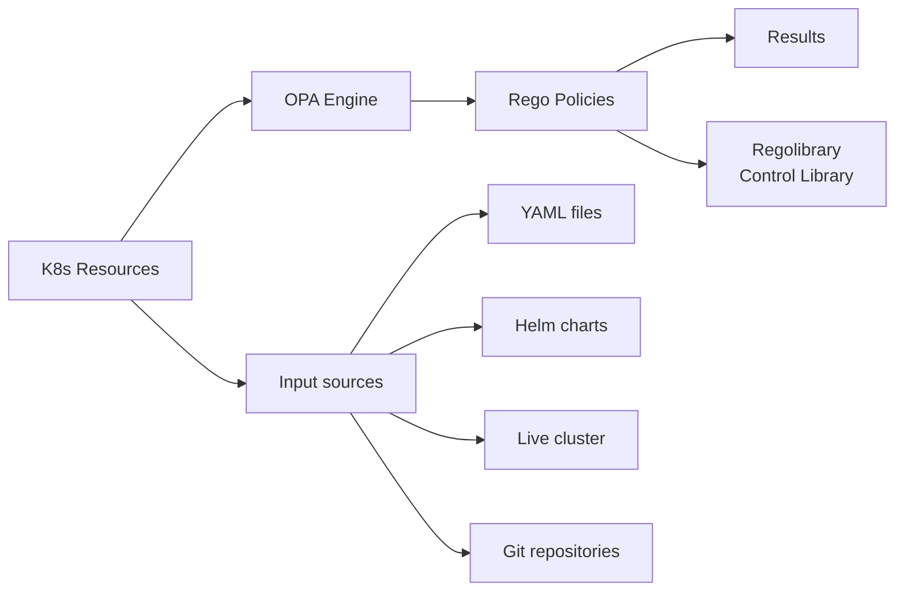
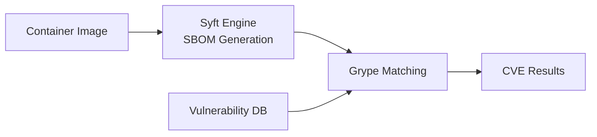
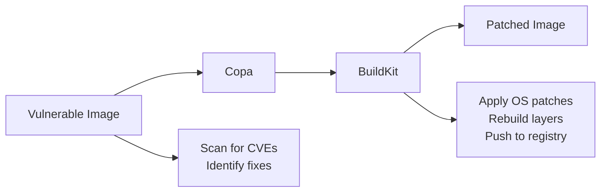
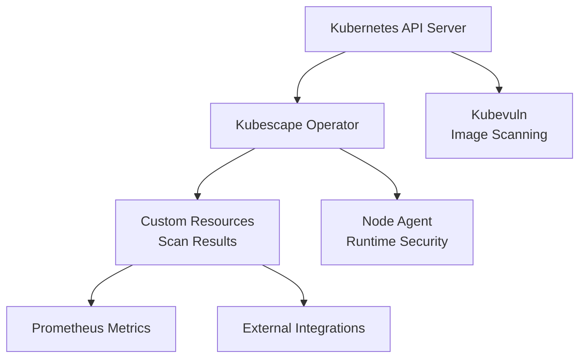
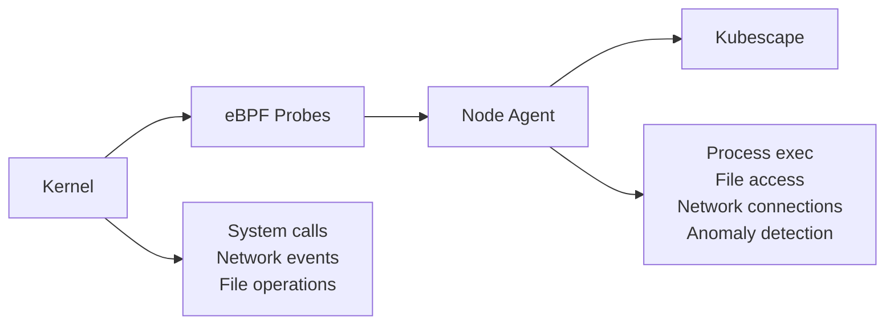

Kubescape is a modular security platform that can operate in two primary modes: as an on-demand CLI tool and as a continuous in-cluster operator. Both modes share the same core scanning logic but differ in how they collect data and report results.

## Operating modes

### CLI mode

The CLI is a standalone binary you run from your local machine. It connects to your cluster (or reads local files) on demand, evaluates resources against security policies, and outputs results to the terminal or a file.

**When to use it:** local development, CI/CD pipelines, one-off audits, and air-gapped scanning.

### Operator mode

The Kubescape operator runs as a set of Kubernetes workloads deployed via Helm. It continuously watches for cluster changes, schedules scans, and stores results as Custom Resources that other tools (including the CLI) can query.

**When to use it:** continuous posture management, runtime threat detection, and cluster-wide vulnerability tracking.

---

## CLI architecture

### Command layer (`cmd/`)

The entry point for all CLI operations. Each subcommand maps to a distinct capability:

| Command | Description |
|---------|-------------|
| `scan` | Orchestrates misconfiguration and vulnerability scanning |
| `scan image` | Container image vulnerability scanning |
| `fix` | Auto-remediation of misconfigurations in manifest files |
| `patch` | Container image patching |
| `list` | Lists available frameworks and controls |
| `download` | Downloads artifacts for offline use |
| `vap` | Validating Admission Policy management |
| `mcpserver` | MCP server for AI integration |
| `operator` | Communicates with the in-cluster operator |

### Core engine (`core/`)

The main scanning engine responsible for:

- Loading and parsing Kubernetes resources (from a live cluster, YAML files, Helm charts, or Git repositories)
- Evaluating resources against security controls
- Aggregating and formatting results
- Managing scan lifecycle and configuration

### Policy evaluation (OPA/Rego)

Kubescape uses [Open Policy Agent (OPA)](https://www.openpolicyagent.org/) as its policy engine. Resources are evaluated against Rego policies stored in the [Regolibrary](https://github.com/kubescape/regolibrary).



**Regolibrary** contains:
- 200+ security controls
- Framework definitions (NSA-CISA, MITRE ATT&CK, CIS Benchmarks, and more)
- Control metadata and remediation guidance

Controls are structured as:

```yaml
Control:
  id: C-0005
  name: API server insecure port is enabled
  description: Check if the API server insecure port is enabled
  frameworks:
    - NSA
    - MITRE
  severity: High
  remediation: |
    Disable the insecure port by setting --insecure-port=0
  rules:
    - rego: |
        # OPA/Rego policy code
```

### Image scanning pipeline (Grype)

For vulnerability scanning, Kubescape integrates [Grype](https://github.com/anchore/grype). The pipeline generates a Software Bill of Materials (SBOM) using [Syft](https://github.com/anchore/syft), then matches it against Grype's vulnerability database.



### Image patching pipeline (Copacetic)

For patching vulnerable OS-level packages, Kubescape integrates [Copacetic](https://github.com/project-copacetic/copacetic) and [BuildKit](https://github.com/moby/buildkit):



<Note>
Image patching only fixes OS-level vulnerabilities that have available patches. Application-level vulnerabilities and those marked as "wont-fix" cannot be patched this way.
</Note>

---

## Operator architecture

The Kubescape operator provides continuous security monitoring within the cluster. It is deployed via the [kubescape-operator Helm chart](https://github.com/kubescape/helm-charts).



### Kubescape operator

The main controller that:
- Watches for changes to Kubernetes resources
- Triggers scans on schedule or on demand
- Manages scan lifecycle
- Stores results as Custom Resources

### Kubevuln

Handles container image vulnerability scanning for workloads running in the cluster:
- Scans images discovered in the cluster
- Generates SBOMs (Software Bill of Materials)
- Matches packages against vulnerability databases
- Creates `VulnerabilityManifest` Custom Resources

### Host scanner

Collects security-relevant information directly from cluster nodes:
- Kernel parameters
- Kubelet configuration
- Container runtime settings
- File permissions

### Node agent (runtime security)

For runtime security, the Node Agent uses eBPF via [Inspektor Gadget](https://github.com/inspektor-gadget/inspektor-gadget) to observe kernel-level events:



### Custom Resources

Scan results are stored as Custom Resources in the cluster:

| CRD | Description |
|-----|-------------|
| `VulnerabilityManifest` | Image vulnerability scan results |
| `VulnerabilityManifestSummary` | Aggregated vulnerability summaries |
| `WorkloadConfigurationScan` | Misconfiguration scan results |
| `WorkloadConfigurationScanSummary` | Aggregated configuration summaries |
| `ApplicationProfile` | Runtime behavior profiles |
| `NetworkNeighborhood` | Observed network connections |

---

## Supported frameworks

Kubescape evaluates resources against the following security frameworks:

| Framework | Description |
|-----------|-------------|
| **NSA-CISA** | Kubernetes Hardening Guidance from the National Security Agency and CISA |
| **MITRE ATT&CK** | Threat-based security framework for Kubernetes |
| **CIS Benchmarks** | Center for Internet Security Kubernetes best practices |
| **SOC2** | Service Organization Control 2 compliance |
| **HIPAA** | Healthcare compliance requirements |
| **PCI-DSS** | Payment Card Industry Data Security Standard |

To see what frameworks are available in your installed version:

```bash
kubescape list frameworks
```

---

## Integration points

### HTTP API

The Kubescape CLI can expose an HTTP API for programmatic access. See the [httphandler documentation](https://github.com/kubescape/kubescape/blob/master/httphandler/README.md) for details.

### MCP server

Kubescape includes a built-in [Model Context Protocol (MCP)](https://modelcontextprotocol.io/) server that exposes scan data to AI assistants via stdio:

```bash
kubescape mcpserver
```

### Prometheus metrics

When running in operator mode, Kubescape exposes Prometheus-compatible metrics for integration with monitoring and alerting systems.

### Custom controls

You can write custom security controls in Rego and load them into Kubescape:

```rego
package armo_builtins

deny[msga] {
    input.kind == "Deployment"
    not input.spec.template.spec.securityContext.runAsNonRoot

    msga := {
        "alertMessage": "Deployment should run as non-root",
        "alertScore": 7,
        "failedPaths": ["spec.template.spec.securityContext.runAsNonRoot"],
        "fixPaths": [{"path": "spec.template.spec.securityContext.runAsNonRoot", "value": "true"}]
    }
}
```

---

## Security model

### CLI mode

- Runs with the permissions of the executing user
- Uses kubeconfig for cluster access
- No persistent state is written to the cluster
- Results are stored locally or sent to a configured backend

### Operator mode

- Runs as Kubernetes workloads with defined ServiceAccount RBAC
- Stores results as Custom Resources in the cluster
- Can optionally send data to external backends

### Network requirements

| Component | Outbound connections |
|-----------|---------------------|
| CLI | Vulnerability database updates, framework downloads |
| Operator | Vulnerability database updates, optional external backend |
| Offline | All artifacts can be pre-downloaded; no outbound connections required |
